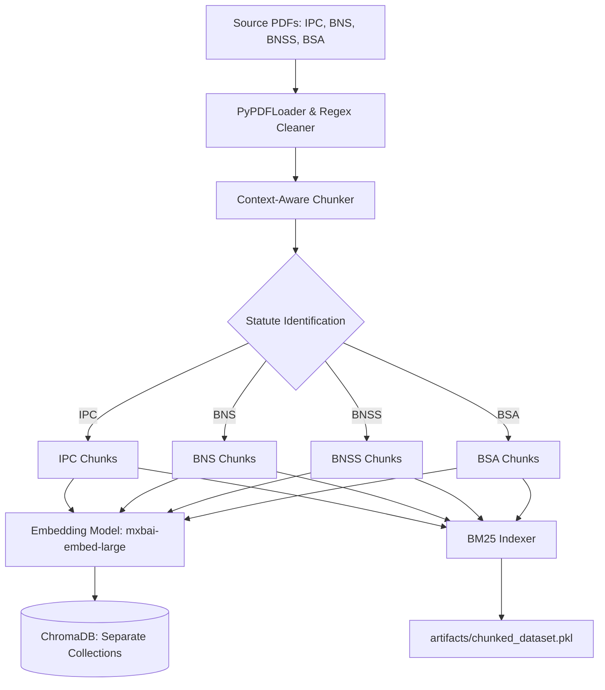
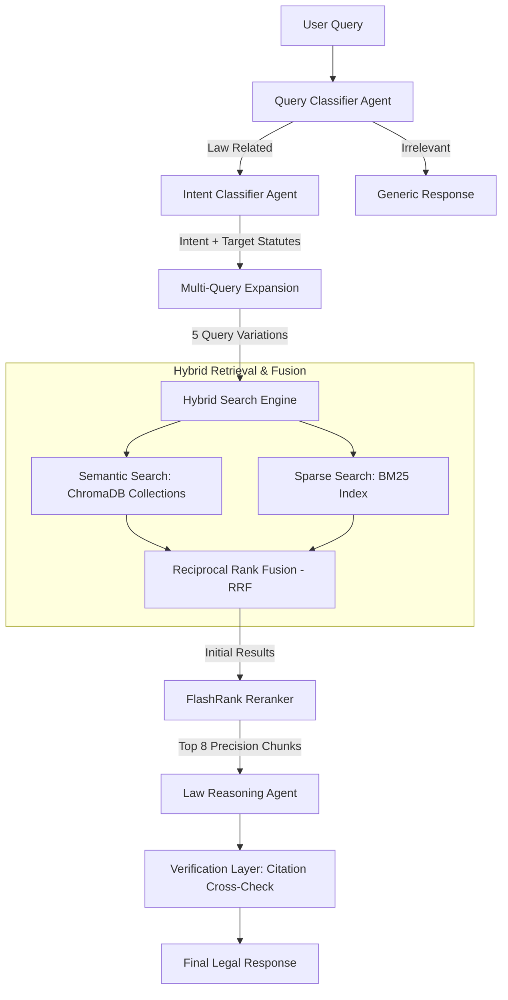

# Nyayora
### *Intelligent Legal Assistant for the New Indian Criminal Law Era*

Nyayora is a state-of-the-art RAG (Retrieval-Augmented Generation) system designed to navigate the complexities of Indian criminal law, providing context-aware analysis across multiple statutes including the IPC, BNS, BNSS, and BSA.

## 🏗️ Technical Architecture & Workflow

The system is divided into two primary phases: the **Build Pipeline** for data preparation and the **Query Pipeline** for real-time inference.

#### 1. Build Pipeline: Multi-Statute Ingestion


#### 2. Query Pipeline: Hybrid RAG Workflow


### Key Components

1.  **Multi-Database Ingestion**: Unlike standard RAG systems, Nyayora maintains 4 separate ChromaDB collections. This allows the **Intent Classifier** to target specific acts (e.g., searching only BNS and BNSS for modern queries), reducing noise and improving accuracy.
2.  **Hybrid Retrieval**: Combines semantic vector search (`mxbai-embed-large`) with traditional keyword search (BM25) using **Reciprocal Rank Fusion (RRF)**. This ensures that specific legal terms and section numbers are retrieved reliably.
3.  **Two-Stage Ranking**:
    *   **Stage 1**: RRF merges scores from multiple vector and keyword sources.
    *   **Stage 2**: **FlashRank Reranker** processes the top 30 candidates to select the absolute most relevant 8 chunks for the LLM context window.
4.  **Verification Layer**: A post-generation check that validates every cited legal section against the retrieved context to eliminate hallucinations before the user sees the answer.
5.  **Agentic Routing**: Uses specialized mini-agents (`qwen3:0.6b`) for classification and expansion to keep the system fast and responsive on consumer hardware.

## 🚀 Quick Start

1. **Build the Index**:
   ```bash
   python -m src.pipelines.rag_build_pipeline
   ```

2. **Run the Server**:
   ```bash
   streamlit run server.py
   ```
